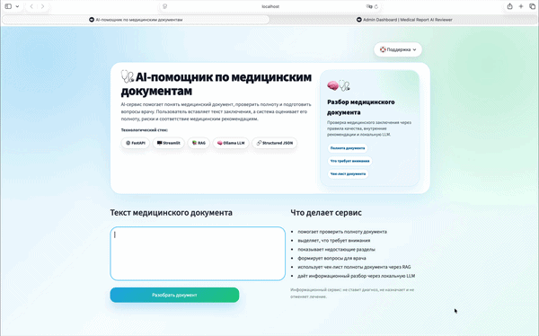

# Medical Document AI Assistant

Production-style AI assistant for medical document analysis, structured review, and AI-powered healthcare workflows.


Built with:

**Python • FastAPI • Streamlit • Ollama • RAG • ChromaDB • Docker**

---

## Overview

Medical Document AI Assistant is an applied AI/LLM project focused on medical document understanding and structured AI analysis.

The system combines:

* LLM-powered medical document review
* RAG-based retrieval over medical guidelines
* structured JSON output
* FastAPI backend
* Streamlit UI
* local LLM support via Ollama
* analytics and support workflows
* production-oriented architecture

The project demonstrates modern AI engineering workflows and product-oriented AI system design.

---

# Demo



---

# Main Interface


---

# AI Analysis Result


---

# Warning Analysis Result


---

# Support Modal


---

# Admin Dashboard


---

# Features

## AI Medical Analysis

* Medical document understanding
* AI-generated summaries
* Missing section detection
* Risk highlighting
* Recommendations and follow-up suggestions
* Confidence scoring
* Structured AI output

---

## RAG Pipeline

* Retrieval over medical guideline documents
* Context grounding for safer outputs
* Vector-based retrieval architecture
* Semantic search support

---

## Backend

* FastAPI REST API
* Pydantic validation
* Structured JSON responses
* Modular architecture
* Production-oriented project structure

---

## UI & Workflow

* Streamlit-based interface
* Analytics dashboard
* Support workflow
* Review history
* Admin dashboard
* Interactive medical review flow

---

## Local LLM Support

* Ollama integration
* Local inference support
* Privacy-oriented architecture

---

# Architecture

```text id="rq2mjk"
User Input
    ↓
Streamlit UI
    ↓
FastAPI Backend
    ↓
AI Agent
    ↓
RAG Retriever
    ↓
Ollama / LLM
    ↓
Structured JSON Output
    ↓
Analytics & Review History
```

---

# Tech Stack

| Category   | Technologies           |
| ---------- | ---------------------- |
| Backend    | FastAPI, Python        |
| Frontend   | Streamlit              |
| LLM        | Ollama                 |
| Retrieval  | RAG, ChromaDB          |
| Validation | Pydantic               |
| Testing    | pytest                 |
| Deployment | Docker, Docker Compose |

---

# Project Structure

```text id="uzy4a6"
medical-document-ai-assistant/
│
├── app/
│   ├── agent.py
│   ├── config.py
│   ├── llm.py
│   ├── main.py
│   ├── prompts.py
│   ├── rag.py
│   ├── schemas.py
│   └── tools.py
│
├── data/
│   ├── guidelines.md
│   ├── examples.jsonl
│   ├── review_history.jsonl
│   ├── analytics_events.jsonl
│   └── support_messages.jsonl
│
├── docs/
│   ├── demo/
│   │   ├── demo.gif
│   │   └── medical-ai-demo.mov
│   │
│   └── screenshots/
│
├── notebooks/
│   └── evaluation.ipynb
│
├── tests/
│   ├── test_agent.py
│   └── test_api.py
│
├── admin_dashboard.py
├── streamlit_app.py
├── docker-compose.yml
├── Dockerfile
├── requirements.txt
└── README.md
```

---

# Quick Start

## Clone Repository

```bash id="ivvv9j"
git clone https://github.com/gitalex156/medical-document-ai-assistant.git
cd medical-document-ai-assistant
```

---

## Install Dependencies

```bash id="wk6m2g"
pip install -r requirements.txt
```

---

## Run Backend

```bash id="l86b0j"
python3 -m uvicorn app.main:app --reload
```

---

## Run Streamlit UI

```bash id="4j1nm7"
python3 -m streamlit run streamlit_app.py
```

---

## Run Admin Dashboard

```bash id="df5xgb"
python3 -m streamlit run admin_dashboard.py --server.port 8502
```

---

## Docker

```bash id="7a6lnr"
docker compose up --build
```

---

# Potential Use Cases

* Medical document review
* Patient-facing AI assistants
* Clinical workflow support
* Medical QA automation
* AI-powered healthcare interfaces
* MedTech MVP development

---

# Portfolio Positioning

This project demonstrates:

* Applied AI engineering
* LLM integration
* RAG pipelines
* AI system architecture
* FastAPI backend development
* Streamlit UI workflows
* Local LLM deployment
* Product-oriented AI thinking

---

# Future Improvements

* LangGraph orchestration
* Authentication system
* Role-based admin access
* Cloud deployment
* Real-time analytics
* Advanced evaluation pipeline
* Audit logging
* Multi-model support

---

# Disclaimer

This project is intended for educational and demonstration purposes only.

It does not provide medical diagnosis or treatment recommendations and is not a substitute for professional medical advice.
