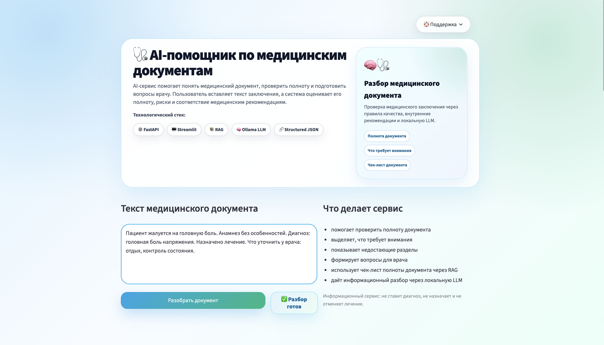
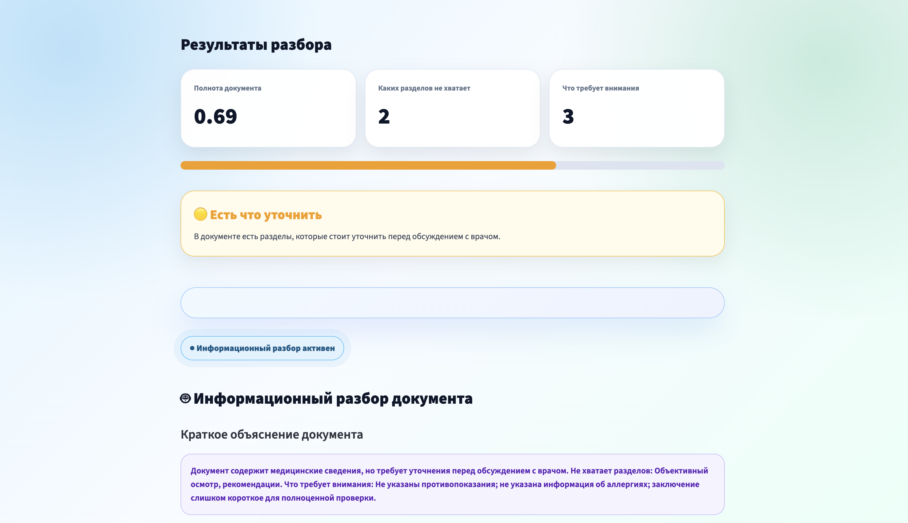
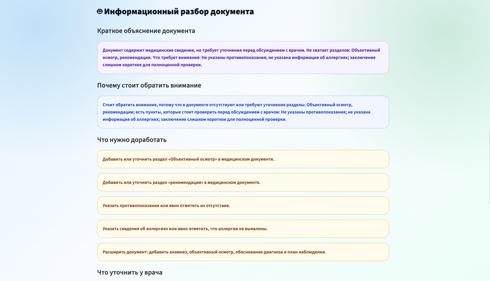
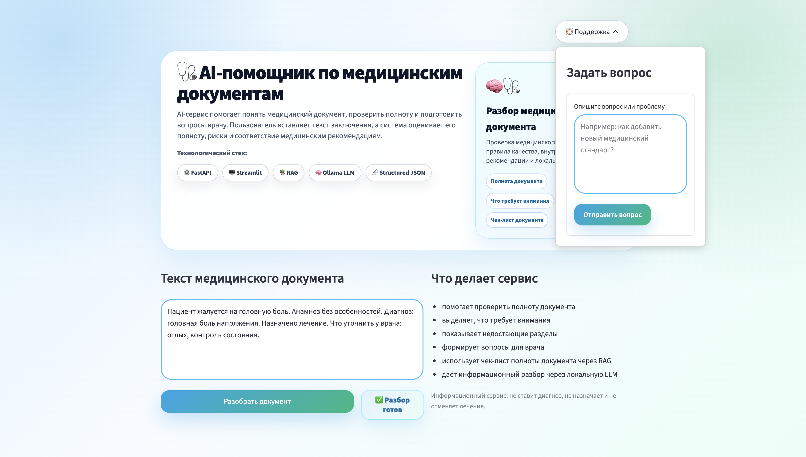
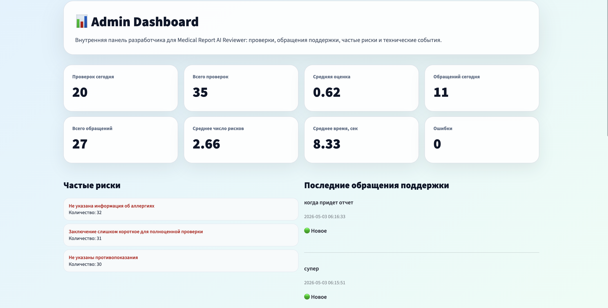

# Medical Document AI Assistant

Production-style AI assistant for medical document analysis, structured review, and AI-powered healthcare workflows.

Built with:

**Python • FastAPI • Streamlit • Ollama • RAG • ChromaDB • Docker**

---

# Overview

Medical Document AI Assistant is an applied AI/LLM project focused on medical document understanding and structured AI analysis.

The system combines:

* LLM-powered medical document review
* RAG-based retrieval over medical guidelines
* structured JSON output
* FastAPI backend
* Streamlit UI
* local LLM support via Ollama
* analytics and support workflows
* production-oriented architecture

---

# Main Interface



---

# AI Analysis Result



---

# Warning Analysis Result



---

# Support Modal



---

# Admin Dashboard



---

# Features

## AI Medical Analysis

* Medical document understanding
* AI-generated summaries
* Missing section detection
* Risk highlighting
* Recommendations and follow-up suggestions
* Confidence scoring

## RAG Pipeline

* Retrieval over medical guideline documents
* Context grounding for safer outputs
* Vector-based retrieval architecture

## Backend

* FastAPI REST API
* Pydantic validation
* Structured JSON responses
* Modular architecture

## UI

* Streamlit-based interface
* Analytics dashboard
* Support workflow
* Review history

## Local LLM Support

* Ollama integration
* Local inference support
* Privacy-oriented architecture

---

# Architecture

```text
User Input
    ↓
Streamlit UI
    ↓
FastAPI Backend
    ↓
AI Agent
    ↓
RAG Retriever
    ↓
Ollama / LLM
    ↓
Structured JSON Output
```

---

# Tech Stack

| Category   | Technologies    |
| ---------- | --------------- |
| Backend    | FastAPI, Python |
| Frontend   | Streamlit       |
| LLM        | Ollama          |
| Retrieval  | RAG, ChromaDB   |
| Validation | Pydantic        |
| Testing    | pytest          |
| Deployment | Docker          |

---

# Project Structure

```text
medical-document-ai-assistant/
│
├── app/
│   ├── agent.py
│   ├── config.py
│   ├── llm.py
│   ├── main.py
│   ├── prompts.py
│   ├── rag.py
│   ├── schemas.py
│   └── tools.py
│
├── data/
│   ├── guidelines.md
│   ├── examples.jsonl
│   ├── review_history.jsonl
│   └── analytics_events.jsonl
│
├── docs/
│   └── screenshots/
│
├── notebooks/
│   └── evaluation.ipynb
│
├── tests/
│   ├── test_agent.py
│   └── test_api.py
│
├── admin_dashboard.py
├── streamlit_app.py
├── docker-compose.yml
├── Dockerfile
├── requirements.txt
└── README.md
```

---

# Quick Start

## Clone Repository

```bash
git clone https://github.com/gitalex156/medical-document-ai-assistant.git
cd medical-document-ai-assistant
```

## Install Dependencies

```bash
pip install -r requirements.txt
```

## Run Backend

```bash
python3 -m uvicorn app.main:app --reload
```

## Run Streamlit UI

```bash
python3 -m streamlit run streamlit_app.py
```

## Run Admin Dashboard

```bash
python3 -m streamlit run admin_dashboard.py --server.port 8502
```

---

# Docker

```bash
docker compose up --build
```

---

# Potential Use Cases

* Medical document review
* Patient-facing AI assistants
* Clinical workflow support
* Medical QA automation
* AI-powered healthcare interfaces
* MedTech MVP development

---

# Disclaimer

This project is intended for educational and demonstration purposes only.

It does not provide medical diagnosis or treatment recommendations and is not a substitute for professional medical advice.
